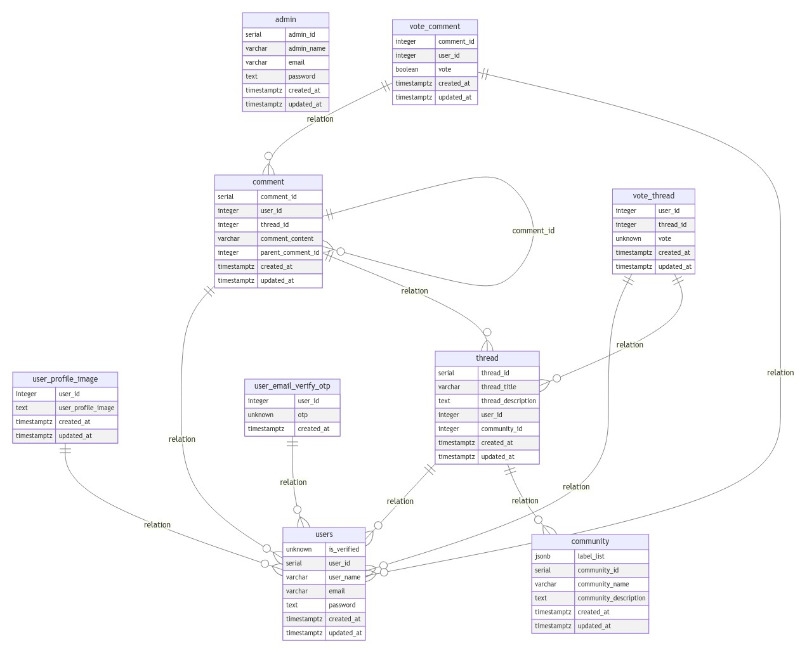

[![Contributors][contributors-shield]][contributors-url]  
[![Forks][forks-shield]][forks-url]  
[![Stargazers][stars-shield]][stars-url]  
[![Issues][issues-shield]][issues-url]  
[![MIT License][license-shield]][license-url]  
[![LinkedIn][linkedin-shield]][linkedin-url]  

<!-- PROJECT LOGO -->
<div align="center" id="readme-top">
  <a href="https://github.com/tusharad/sql2er">
    
  </a>

  <h1 align="center">SQL 2 ER</h1>

  <p align="center">
    A command-line tool to convert SQL scripts into Entity-Relationship (ER) diagrams.
    <br>
    Designed to work with PostgreSQL syntax.
    <br>
    <a href="https://github.com/tusharad/sql2er/issues/new?labels=bug&template=bug-report---.md"><strong>Report a Bug</strong></a>
    ·
    <a href="https://github.com/tusharad/sql2er/issues/new?labels=enhancement&template=feature-request---.md"><strong>Request a Feature</strong></a>
  </p>
</div>

---

## Table of Contents

- [Example](#example)  
- [Getting Started](#getting-started)  
- [Built With](#built-with)  
- [Roadmap](#roadmap)  
- [Limitations](#limitations)  
- [Unsupported Features](#unsupported-features)  
- [Acknowledgments](#acknowledgments)

---
## [Checkout](https://tusharad.github.io/sql2er/) web version powered by WebAssembly


## Example

**Input: `test.sql`**

```sql
begin;

create table users (
	user_id serial primary key
  , user_name varchar(255) not null unique
  , email varchar(255) not null unique
  , password text not null
  , created_at timestamptz default now()
  , updated_at timestamptz default now()
);

create table user_profile_image (
	user_id int references users on delete cascade primary key
 ,  user_profile_image text not null
 ,  created_at timestamptz default now()
 ,  updated_at timestamptz default now()
);
...
```

**Command:**

```bash
./sql2er-exe test.sql -o erd.jpeg
```

**Output:**



---

## Getting Started

### Option 1: Download Binary

1. Download the binary from the [Releases](https://github.com/tusharad/sql2er/releases) page.
2. Run the tool:

    ```bash
    ./sql2er-exe test.sql -o erd.jpeg
    ```

### Option 2: Build from Source

1. Install [Stack](https://docs.haskellstack.org/en/stable/) via [GHCup](https://www.haskell.org/ghcup/).
2. Clone the repository and navigate to the project root.
3. Build the binary for linux:

    ```bash
    stack build
    cp $(stack path --local-install-root)/bin/sql2er-exe .
    ./sql2er-exe test.sql -o erd.jpeg
    ```

### Option 3: Build WASM

1. Install `wasm32-wasi-cabal` from [here](https://gitlab.haskell.org/ghc/ghc-wasm-meta)
2. Make sure to download the `9.8` `FLAVOUR`.

```bash
wasm32-wasi-cabal build sql2er-wasm -f build-sql2er-wasm
cp path/to/sql2er-wasm.wasm .
python3 -m http.server
```

---

## Built With

[![Haskell][Haskell]][Haskell-url]

<p align="right">(<a href="#readme-top">back to top</a>)</p>

---

## Roadmap

- [x] Add Changelog  
- [x] Add Test Cases  
- [x] Support `GENERATED` Constraint  
- [x] Gracefully Ignore Partitions  
- [x] Support `bigserial`  
- [ ] Add Additional Examples  
- [ ] Enhance Documentation  
- [ ] Add More Parsing Functions  
- [ ] Support Interval Data Type  
- [ ] Support 2D Arrays  

For the full list of proposed features and known issues, check out the [open issues](https://github.com/tusharad/sql2er/issues).

<p align="right">(<a href="#readme-top">back to top</a>)</p>

---

## Limitations

- Needs internet connection since, We are sending request to mermaid API.
- **Syntax Validation:**  
  The parser doesn't validate SQL syntax; it extracts only the necessary information for generating ER diagrams.  
- **PostgreSQL Specific:**  
  Designed and tested using PostgreSQL 17.  

<p align="right">(<a href="#readme-top">back to top</a>)</p>

---

## Unsupported Features

- `DETACH`  
- `USING ...`  
- `TABLESPACE`  
- `NOT VALID`  
- `VALIDATE`  
- `INTERVAL` Data Type  

<p align="right">(<a href="#readme-top">back to top</a>)</p>

---

## Acknowledgments

This project was inspired by [sqldiagram](https://github.com/RadhiFadlillah/sqldiagram), which focuses on MySQL but lacked robust parsing capabilities.

<p align="right">(<a href="#readme-top">back to top</a>)</p>

<!-- MARKDOWN LINKS & IMAGES -->
[contributors-shield]: https://img.shields.io/github/contributors/tusharad/sql2er.svg?style=for-the-badge
[contributors-url]: https://github.com/tusharad/sql2er/graphs/contributors
[forks-shield]: https://img.shields.io/github/forks/tusharad/sql2er.svg?style=for-the-badge
[forks-url]: https://github.com/tusharad/sql2er/network/members
[stars-shield]: https://img.shields.io/github/stars/tusharad/sql2er.svg?style=for-the-badge
[stars-url]: https://github.com/tusharad/sql2er/stargazers
[issues-shield]: https://img.shields.io/github/issues/tusharad/sql2er.svg?style=for-the-badge
[issues-url]: https://github.com/tusharad/sql2er/issues
[license-shield]: https://img.shields.io/github/license/tusharad/sql2er.svg?style=for-the-badge
[license-url]: https://github.com/tusharad/sql2er/blob/main/LICENSE.txt
[linkedin-shield]: https://img.shields.io/badge/-LinkedIn-black.svg?style=for-the-badge&logo=linkedin&colorB=555
[linkedin-url]: https://linkedin.com/in/tushar-adhatrao
[Haskell]: https://img.shields.io/badge/Haskell-5e5086?style=for-the-badge&logo=haskell&logoColor=white
[Haskell-url]: https://www.haskell.org/
