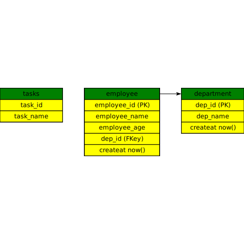

[![Contributors][contributors-shield]][contributors-url]
[![Forks][forks-shield]][forks-url]
[![Stargazers][stars-shield]][stars-url]
[![Issues][issues-shield]][issues-url]
[![MIT License][license-shield]][license-url]
[![LinkedIn][linkedin-shield]][linkedin-url]

<!-- PROJECT LOGO -->
<br />
<div align="center">
  <a href="https://github.com/tusharad/sql2er">
    
  </a>

  <h3 align="center">SQL 2 ER</h3>

  <p align="center">
    SQL2ER is a command line tool that takes SQL script as input and generates an ER diagram. The parser is written to adopt PostgreSQL syntax.
    <a href="https://github.com/tusharad/sql2er/issues/new?labels=bug&template=bug-report---.md">Report Bug</a>
    ·
    <a href="https://github.com/tusharad/sql2er/issues/new?labels=enhancement&template=feature-request---.md">Request Feature</a>
  </p>
</div>

### Example

test.sql

```sql
create table department (dep_id serial primary key, dep_name varchar(30), createAt timestamptz default now());
create table employee ( employee_id serial primary key, employee_name varchar(30), employee_age int, 
    dep_id int references department (dep_id) on delete cascade, createAt timestamptz default now());
create table tasks (task_id int, task_name text);
```

```bash
./sql2er-exe test.sql -o erd.svg
```

#### Output



## Getting Started

Here are 2 ways to use this tool

1. Download the binary from release and simply run it.

```bash
./sql2er-exe test.sql -o erd.svg
```

2. Build from source:

You can download [stack](https://docs.haskellstack.org/en/stable/) via [GHCup](https://www.haskell.org/ghcup/).

then simply build and run using below command from the root directory of the project.

```
stack run -- test.sql -o erd.svg
```

### Built With

[![Haskell][Haskell]][Haskell-url]

<p align="right">(<a href="#readme-top">back to top</a>)</p>

<!-- ROADMAP -->
## Roadmap

- [x] Add Changelog
- [ ] Add Additional Examples
- [ ] Add more parsing functions
- [ ] Add more documentation
- [x] Adding test cases
- [ ] Adding support for interval data type
- [x] GENERATED constraint
- [ ] Parse 2D array

See the [open issues](https://github.com/tusharad/sql2er/issues) for a full list of proposed features (and known issues).

<p align="right">(<a href="#readme-top">back to top</a>)</p>

### Limitations:
- The parser is not smart enough to find syntactical errors in the SQL. It will only extract neccecary information for it to generate an ERD.
- ForeignKeyConstraint can only handle a single column and not a list of column.
- The tool is mainly tested and is following postgres version 17 documentation.
- Not able to parse (to ignore) `Create function` statements. If it came across `create function` statement, it will take rest and stop parsing.

<p align="right">(<a href="#readme-top">back to top</a>)</p>

### does not support:
- detach
- using ...
- tablespace
- not valid
- validate
- interval data type

<!-- ACKNOWLEDGMENTS -->
## Acknowledgments

- This tool is inspired by [sqldiagram](https://github.com/RadhiFadlillah/sqldiagram) but the tool was created for MySQL and the parser was weak.

<p align="right">(<a href="#readme-top">back to top</a>)</p>

<!-- MARKDOWN LINKS & IMAGES -->
<!-- https://www.markdownguide.org/basic-syntax/#reference-style-links -->
[contributors-shield]: https://img.shields.io/github/contributors/tusharad/sql2er.svg?style=for-the-badge
[contributors-url]: https://github.com/tusharad/sql2er/graphs/contributors
[forks-shield]: https://img.shields.io/github/forks/tusharad/sql2er.svg?style=for-the-badge
[forks-url]: https://github.com/tusharad/sql2er/network/members
[stars-shield]: https://img.shields.io/github/stars/tusharad/sql2er.svg?style=for-the-badge
[stars-url]: https://github.com/tusharad/sql2er/stargazers
[issues-shield]: https://img.shields.io/github/issues/tusharad/sql2er.svg?style=for-the-badge
[issues-url]: https://github.com/tusharad/sql2er/issues
[license-shield]: https://img.shields.io/github/license/tusharad/sql2er.svg?style=for-the-badge
[license-url]: https://github.com/tusharad/sql2er/blob/main/LICENSE.txt
[linkedin-shield]: https://img.shields.io/badge/-LinkedIn-black.svg?style=for-the-badge&logo=linkedin&colorB=555
[linkedin-url]: https://linkedin.com/in/tushar-adhatrao
[Haskell]: https://img.shields.io/badge/Haskell-5e5086?style=for-the-badge&logo=haskell&logoColor=white
[Haskell-url]: https://www.haskell.org/
